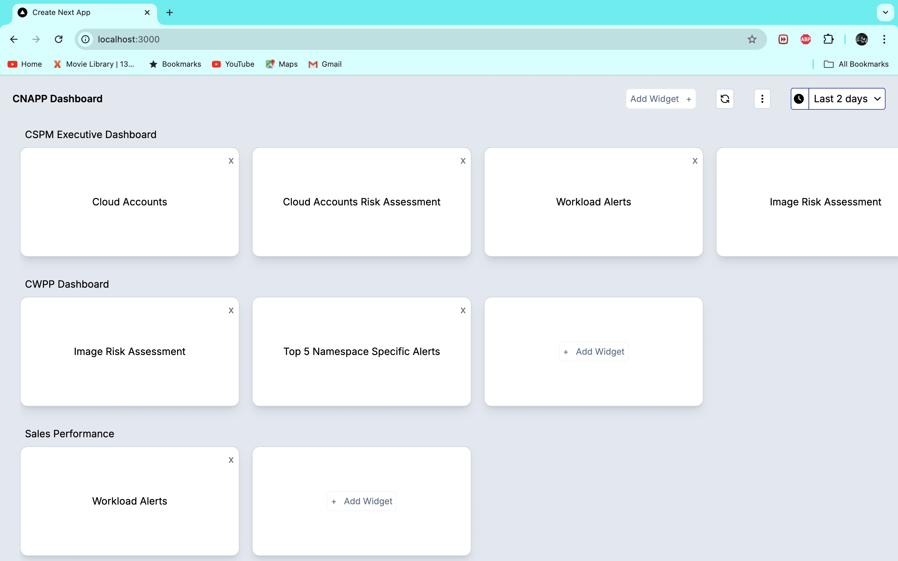
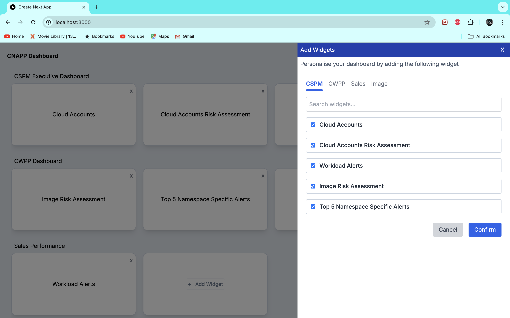
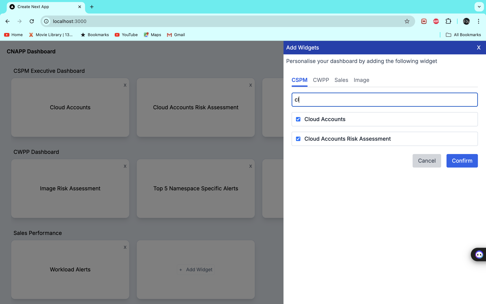

# Dashboard Widget Management Project

This project is a dashboard application built with React.js, Next.js, Redux, and Tailwind CSS. It allows users to manage dashboard widgets dynamically. Users can add, remove, and search for widgets, with animations for better user experience.

## Features

- **Dynamic Tabs**: Tabs to switch between different widget categories.
- **Widget Management**: Add or remove widgets to/from categories.
- **Search Functionality**: Search through available widgets.
- **Smooth Animations**: Includes smooth sliding animations for drawers and card transitions.

## Preview

### Dashboard Overview



### Adding Widgets Sidebar



### Smooth Drawer Animation



## Installation

Follow the steps below to set up and run the project locally.

### Prerequisites

- [Node.js](https://nodejs.org/) (v14 or higher)
- [npm](https://www.npmjs.com/) or [yarn](https://yarnpkg.com/)

### Setup

1. **Clone the repository**

   ```bash
   git clone https://github.com/yourusername/your-repo-name.git
   cd your-repo-name
   ```

2. **Install dependencies**

   If using `npm`:

   ```bash
   npm install
   ```

   Or if using `yarn`:

   ```bash
   yarn install
   ```

3. **Run the development server**

   Start the development server on `localhost:3000`:

   ```bash
   npm run dev
   ```

   Or with `yarn`:

   ```bash
   yarn dev
   ```

4. **Build for production**

   To create an optimized build for production:

   ```bash
   npm run build
   npm start
   ```

   Or with `yarn`:

   ```bash
   yarn build
   yarn start
   ```

## Project Structure

The main folders and files in this project include:

```
.
├── components
│   ├── Dashboard.tsx       # Main dashboard component with widget management
│   ├── Card.tsx            # Card component to display individual widgets
│   ├── addWidget.tsx       # Component to add new widgets
│   └── widgets.tsx         # Component with dynamic tabs and animations
├── redux
│   ├── reducers
│   │   ├── widgetSlice.ts  # Redux slice for widget management
│   │   └── index.ts        # Manage all Redux slices
│   └── store.ts
├── Provider
│   ├── reduxProvider.ts
├── public
│   └── images
├── layout.tsx          # Layout page of the application
├── global.css          # Global css of the application
└── page.tsx            # Home page of the application
└── README.md

```

## Widget Management Flow

### Adding Widgets

The user can open the widget management sidebar, search for available widgets, and add them to the active tab category. Widgets already added are automatically checked.

### Removing Widgets

Users can also remove widgets directly from the category. This will be reflected both in the UI and state management.

## State Management

This project uses [Redux] for state management. The widgets are managed in the `widgetSlice.ts` file, which handles the logic for adding and removing widgets.

### Key Redux Functions

- `addWidget`: Adds a widget to the selected category.
- `removeWidget`: Removes a widget from the selected category.
- `setCategories`: Sets the categories in the Redux store.

## Styling

The project uses [Tailwind CSS](https://tailwindcss.com/) for styling, ensuring that the application is fully responsive and follows modern design principles.

## Animations

All animations are handled using Tailwind CSS utility classes, providing a smooth user experience for opening drawers, tabs, and adding/removing widgets.

---
